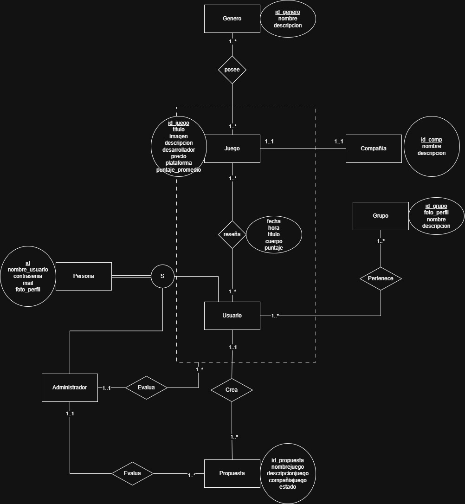

# gamerboxd_Java_TP
<h2> Integrantes </h2>
52986 - Juan Bautista Perez   
52150 - Santiago Malet   

<h2> Enunciado General </h2>

 Gamerboxd es una aplicación web para poder puntuar videojuegos. Los usuarios podrán seleccionar de un amplio catálogo de videojuegos aquellos que deseen para reseñarlos. En caso de que el juego buscado no se encuentre se podrá solicitar que se agregue al catálogo. Los administradores manejan estas solicitudes y controlan si la información proporcionada es correcta. Cada usuario va a contar con su perfil, donde otros usuarios van a poder seguirlos y ver sus reseñas en su página principal.   
Los usuarios pueden crear grupos de reseñadores y solicitar unirse a otros grupos. Los administradores del grupo (permisos otorgados por el creador) aceptan o niegan la petición. Estos grupos juntan muchos reseñadores y permiten a ellos publicar reseñas bajo un mismo nombre. La página del grupo mostrará su imagen de perfil, el nombre de los miembros y los juegos reseñados por ellos. 
   

<h2>Diagrama de Entidad Relación </h2>

<h2>Checklist regularidad</h2>

| Requerimiento    | Detalles |
|------------------|----------|
| ABMC Simple      | Persona, Juego         |
| ABMC Dependiente | Administrador         |
| CU NO-ABMC       | Reseña         |
| Listado simple   | Listado de juegos         |

<h2>Checklist promoción directa</h2>

| Requerimiento                 | Detalles |
|-------------------------------|----------|
| ABMC                          | Personas, Usuario, Juego, Compañia, Grupo, Administrador, Propuesta          |
| CU "Complejo" (nivel resumen) | Realizar reseña         |
| Listado complejo              | Listar juegos por compañia         |
| Nivel de acceso               | Usuario, Administrador         |

