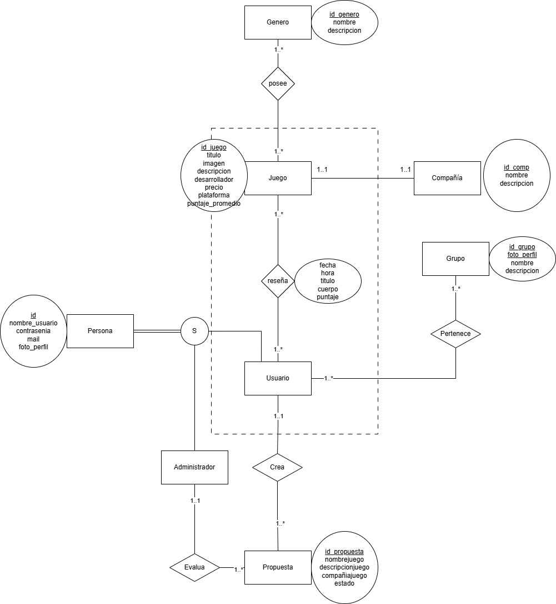

# gamerboxd_Java_TP
<h2> Integrantes </h2>
52986 - Juan Bautista Perez   
52150 - Santiago Malet   

<h2> Enunciado General </h2>

 Gamerboxd es una aplicación web para poder puntuar videojuegos. Los usuarios podrán seleccionar de un amplio catálogo de videojuegos el videojuego deseado para reseñar. En caso de que el juego buscado no se encuentre se podrá solicitar que se agregue al catálogo. Los administradores manejan estas solicitudes y controlan si la información proporcionada es correcta. Cada usuario va a contar con su perfil, donde otros usuarios van a poder seguirlos y ver sus reseñas en su página principal.   
Los usuarios pueden crear grupos de reseñadores, los cuales otros usuarios pueden pedir unirse, en donde los administradores del grupo (permisos otorgados por el creador) aceptan o niegan la petición. Estos grupos juntan muchos reseñadores y permiten a ellos publicar reseñas bajo el nombre de ese grupo. La página del grupo mostrará todas las reseñas hechas por los miembros, los miembros de los grupos y el perfil del grupo. 
   

<h2>Diagrama de Entidad Relacional </h2>

<h2>Checklist regularidad</h2>

| Requerimiento    | Detalles |
|------------------|----------|
| ABMC Simple      |          |
| ABMC Dependiente |          |
| CU NO-ABMC       |          |
| Listado simple   |          |

<h2>Checklist promoción directa</h2>

| Requerimiento                 | Detalles |
|-------------------------------|----------|
| ABMC                          |          |
| CU "Complejo" (nivel resumen) |          |
| Listado complejo              |          |
| Nivel de acceso               |          |
| Manejo de errores             |          |
| Publicar el sitio             |          |

